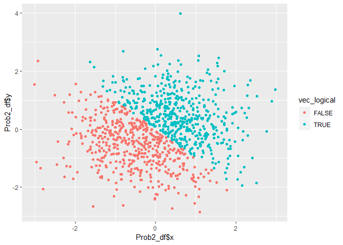
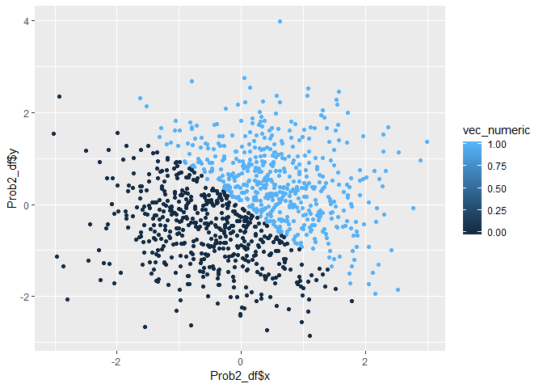
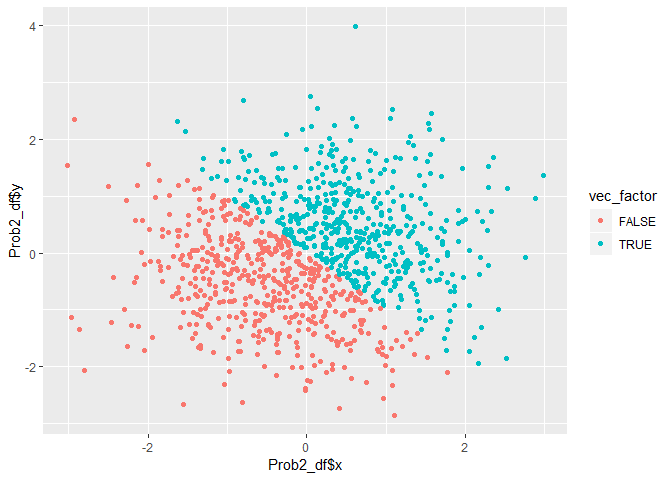

p8105\_hw1
================
Yue Gu
2018-09-16

Library
=======

``` r
library(tidyverse)
```

Problem 1
=========

Creating data frame
-------------------

Here's a random sample of size 10 from a uniform\[0,5\] distribution, and I created logical vector, character vector and factor vector as required.

``` r
set.seed(1)
Prob1_df = tibble(
  vec_numeric = runif(10, min = 0, max = 5),
  vec_logical = c(vec_numeric > 2),
  vec_char = c("I", "am", "happy", "to", "take", "the", "data", "science", "course", "today"),
  vec_factor = factor(c("T", "F", "T", "F", "T", "F", "T", "T", "F", "F"))
)
```

Examine classes:

``` r
class(Prob1_df$vec_numeric)
```

    ## [1] "numeric"

``` r
class(Prob1_df$vec_logical)
```

    ## [1] "logical"

``` r
class(Prob1_df$vec_char)
```

    ## [1] "character"

``` r
class(Prob1_df$vec_factor)
```

    ## [1] "factor"

Length of the vector shown below:

``` r
length(Prob1_df$vec_char)
```

    ## [1] 10

``` r
length(Prob1_df$vec_factor)
```

    ## [1] 10

Take means
----------

``` r
mean(Prob1_df$vec_numeric)
```

    ## [1] 2.757569

``` r
mean(Prob1_df$vec_logical)
```

    ## [1] 0.6

``` r
mean(Prob1_df$vec_char)
```

    ## Warning in mean.default(Prob1_df$vec_char): argument is not numeric or
    ## logical: returning NA

    ## [1] NA

``` r
mean(Prob1_df$vec_factor)
```

    ## Warning in mean.default(Prob1_df$vec_factor): argument is not numeric or
    ## logical: returning NA

    ## [1] NA

When taking the mean of each variable, only vec\_numeric works since it's the only numerical variable that could have take mean while vec\_logical are logical values, vec\_char are character values and vec\_factor are factors values that can't take means.

Transforming variable type
--------------------------

Tranfoming to numerical variable:

``` r
as.numeric(Prob1_df$vec_logical)
as.numeric(Prob1_df$vec_char)
as.numeric(Prob1_df$vec_factor)
```

Converting character variable from character to factor to numeric:

``` r
as.factor(Prob1_df$vec_char)
```

    ##  [1] I       am      happy   to      take    the     data    science
    ##  [9] course  today  
    ## Levels: am course data happy I science take the to today

``` r
as.numeric(Prob1_df$vec_char)
```

    ## Warning: NAs introduced by coercion

    ##  [1] NA NA NA NA NA NA NA NA NA NA

``` r
mean(as.numeric(Prob1_df$vec_char))
```

    ## Warning in mean(as.numeric(Prob1_df$vec_char)): NAs introduced by coercion

    ## [1] NA

``` r
class(as.numeric(Prob1_df$vec_char))
```

    ## Warning: NAs introduced by coercion

    ## [1] "numeric"

And the vec\_char has been explicitly changed into numerical value that could take mean as "NA", and could be changed into a factor variable

Converting factor variable from factor to character to numeric:

``` r
as.character(Prob1_df$vec_factor)
```

    ##  [1] "T" "F" "T" "F" "T" "F" "T" "T" "F" "F"

``` r
as.numeric(Prob1_df$vec_factor)
```

    ##  [1] 2 1 2 1 2 1 2 2 1 1

``` r
mean(as.numeric(Prob1_df$vec_factor))
```

    ## [1] 1.5

``` r
class(as.numeric(Prob1_df$vec_factor))
```

    ## [1] "numeric"

And the vec\_factor has been explictly changed into numerical value based on "T" or "F" and could take mean as "1.5", and it could be changed into a factor variable

Problem 2
=========

Creating data frame
-------------------

``` r
Prob2_df = tibble(
  x = rnorm(1000, mean = 0, sd = 1),
  y = rnorm(1000, mean = 0, sd = 1),
  vec_logical = c(x + y > 0),
  vec_numeric = as.numeric(vec_logical),
  vec_factor = as.factor(vec_logical)
)
```

The size of the dataset is 1000 rows and 5 columns, the mean of x is -0.0106382, the median of x is -0.031318, and the proportion of cases for which the logical vector is TRUE is 0.49.

Make scatterplots
-----------------

First Scatterplot making color points using the logical variable

``` r
ggplot(Prob2_df, aes(x = Prob2_df$x, y = Prob2_df$y, color = vec_logical)) + geom_point()
```

 From the scatterplot, we could see almost 50% of the logcial variables datapoints lie as True and 50% lie as False. The real proportion of True is calculated by R as 49% when setting seed as 1.

Second Scatterplot making color points using the numeric variable

``` r
ggplot(Prob2_df, aes(x = Prob2_df$x, y = Prob2_df$y, color = vec_numeric)) + geom_point()
```

 From the scatterplot, we could see almost 50% of the numerical variables datapoints lie as True and 50% lie as False. The real proportion of True is calculated by R as 49% when setting seed as 1.

Third Scatterplot making color points using the factor variable

``` r
ggplot(Prob2_df, aes(x = Prob2_df$x, y = Prob2_df$y, color = vec_factor)) + geom_point()
```

 From the scatterplot, we could see almost 50% of the factor variables datapoints lie as True and 50% lie as False. The real proportion of True is calculated by R as 49% when setting seed as 1.

Export first scatterplot
------------------------

``` r
ggsave("1st_scatterplot.png", plot = ggplot(Prob2_df, aes(x = Prob2_df$x, y = Prob2_df$y, color = vec_logical)) + geom_point())
```

    ## Saving 7 x 5 in image
